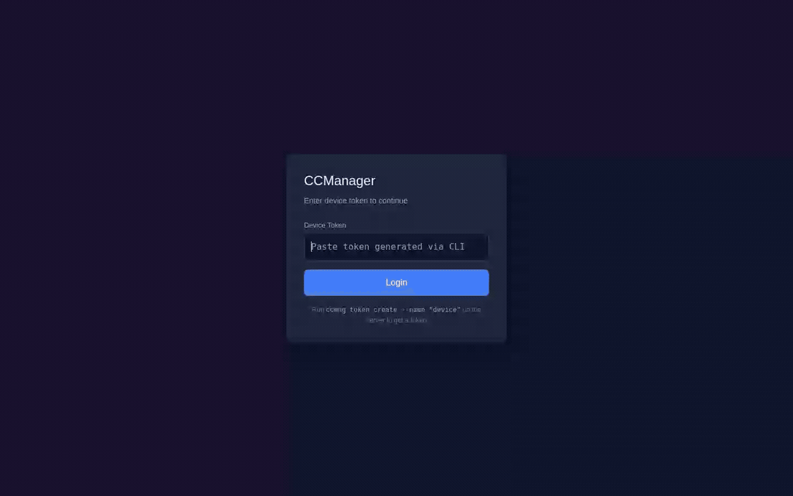
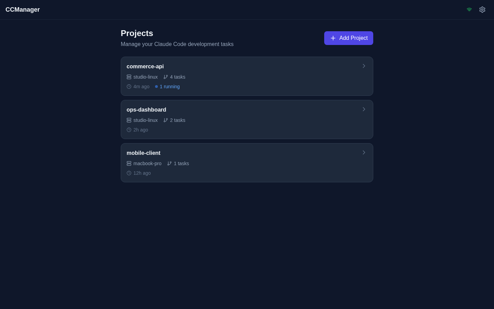
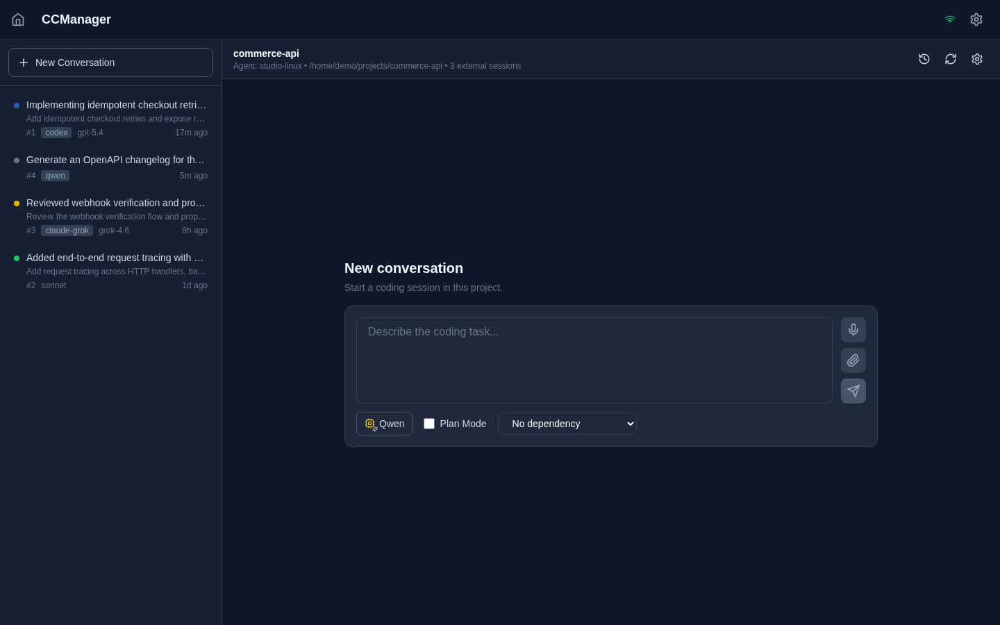
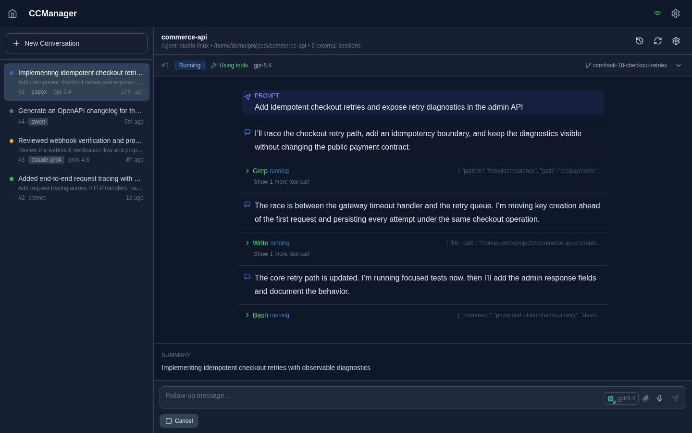
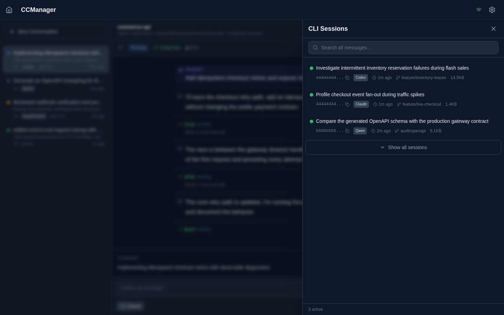
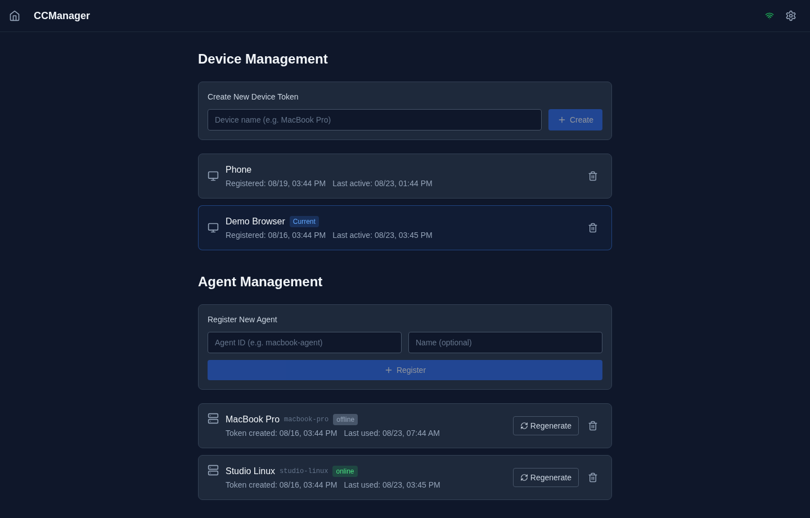
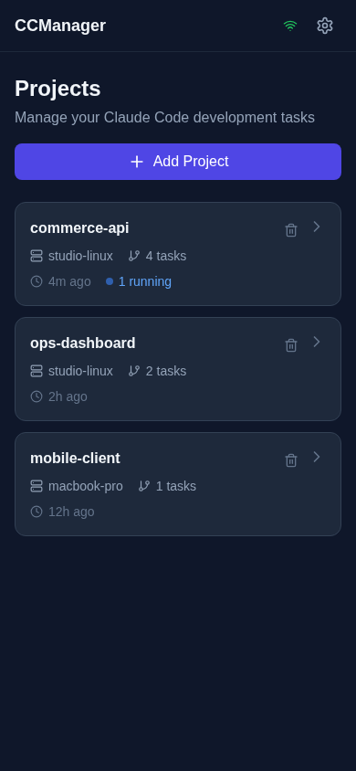
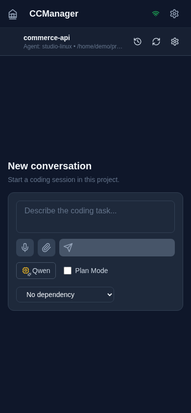

# CCManager

**English** | [中文](./README.zh-CN.md)

CCManager is a self-hosted control plane for running coding-agent tasks across multiple machines. It combines a conversation-oriented Web UI, an Express/Socket.IO server, and lightweight agents that launch locally installed coding CLIs.

<p align="center">
  
</p>

## What It Supports

- **Conversation workspace** — Each project has a persistent conversation sidebar, live timeline, follow-up composer, status controls, summaries, and runner/model metadata.
- **Multiple coding runners** — Claude, Claude Grok, Codex, Qwen, tClaude, and tCodex can be selected per task or follow-up.
- **Agent-discovered models** — Each agent reports the models actually available on that machine; the server validates named model selections before dispatch.
- **Reliable live output** — Versioned stream events, persisted snapshots, replay after reconnect, duplicate suppression, tool-call grouping, Markdown/GFM, math, tables, and code blocks.
- **Existing CLI sessions** — Browse active or historical sessions from Claude, Claude Grok, Codex, Qwen, tClaude, tCodex, and Docker Claude; search messages, inspect merged chains, adopt a session, or continue it with the original runner.
- **Task orchestration** — Parallel tasks, dependencies, cancellation, retry, waiting states, Plan Mode, permission prompts, and orphan-task recovery after reconnect.
- **Rich prompts** — Paste or upload images, add images to follow-ups, and optionally dictate prompts through an OpenAI-compatible Whisper endpoint.
- **Isolation options** — Run plain Claude tasks locally or in hardened Docker containers; optionally create a Git worktree per task and merge or clean it up from the UI.
- **Multi-device security** — Separate hashed tokens for browsers and agents, same-origin CORS, rate limiting, path allow/block lists, and symlink-aware path validation.
- **Deployable below `/ccm`** — The production SPA, API, WebSocket path, and PWA assets support reverse-proxy deployment under the `/ccm` base path.

## Current Screenshots

The screenshots below are generated from the current production build with fictional data.

<table>
  <tr>
    <td align="center"><b>Projects</b></td>
    <td align="center"><b>New Conversation</b></td>
  </tr>
  <tr>
    <td></td>
    <td></td>
  </tr>
  <tr>
    <td align="center"><b>Live Conversation</b></td>
    <td align="center"><b>CLI Session Browser</b></td>
  </tr>
  <tr>
    <td></td>
    <td></td>
  </tr>
  <tr>
    <td align="center" colspan="2"><b>Device and Agent Management</b></td>
  </tr>
  <tr>
    <td colspan="2"></td>
  </tr>
</table>

<details>
<summary><b>Mobile views</b></summary>
<br>
<table>
  <tr>
    <td align="center"><b>Projects</b></td>
    <td align="center"><b>Conversation Composer</b></td>
  </tr>
  <tr>
    <td></td>
    <td></td>
  </tr>
</table>
</details>

## Architecture

```text
Browser / installed PWA
        │ HTTPS + Socket.IO
        ▼
┌───────────────────────────────────────┐
│ @ccmanager/server                    │
│ Express API · Socket.IO · SQLite     │
│ serves @ccmanager/web under /ccm     │
└───────────────┬───────────────────────┘
                │ authenticated agent sockets
        ┌───────┴────────┬──────────────────┐
        ▼                ▼                  ▼
  Linux agent       macOS agent       additional agents
  local/Docker      local execution   concurrent execution
        │                │                  │
        └──── Claude / Claude Grok / Codex / Qwen / tClaude / tCodex
```

| Package | Role |
|---|---|
| `@ccmanager/server` | REST API, Socket.IO namespaces, task dispatch, SQLite storage, stream replay, session routing, token CLI |
| `@ccmanager/web` | React 18 SPA, conversation UI, session browser, project/device/agent management, PWA |
| `@ccmanager/agent` | Connects a machine to the server, discovers local runner models, launches tasks, streams events, and browses local sessions from supported CLIs |
| `ccmng` CLI | Creates/revokes device and agent tokens and makes rotating SQLite backups |

## Runner Support

Runner availability is machine-specific. At startup, each agent probes its installed CLIs and publishes a model catalog to the server.

| UI runner | Local command | Model discovery | Execution |
|---|---|---|---|
| Claude | `claude` | Claude CLI help/settings | Local or Docker |
| Claude Grok | `claude-grok` | `~/.config/distill-grok/claude-settings.json` | Host |
| Codex | `codex` | Codex model catalog/config | Host |
| Qwen | `qwen` | CLI availability; default model | Host |
| tClaude | `tclaude` | CLI/daemon model catalog | Host |
| tCodex | `tcodex` | tCodex model catalog/config | Host |

Docker execution currently wraps the plain `claude` runner. The other runners use their host-side CLI and credentials even when the project executor is set to Docker.

## Prerequisites

| Dependency | Version | Purpose |
|---|---:|---|
| [Node.js](https://nodejs.org/) | `>= 18` | Runtime |
| [pnpm](https://pnpm.io/) | `9.x` | Workspace package manager |
| [PM2](https://pm2.keymetrics.io/) | `>= 5` | Recommended process manager |
| At least one supported coding CLI | Current compatible release | Task execution on each agent |
| [Docker](https://www.docker.com/) | Optional | Plain Claude container execution |

Authenticate each runner on the machine where its agent runs. Docker-mode Claude can reuse `~/.claude/.credentials.json` or receive `CLAUDE_CODE_OAUTH_TOKEN` / `ANTHROPIC_API_KEY` from the agent environment.

## Quick Start

### 1. Start the server

```bash
git clone https://github.com/luyi256/CCManager.git
cd CCManager
bash setup-server.sh
```

The setup script installs dependencies, builds the server and SPA, and creates or restarts the `ccm-server` PM2 process.

Create the first browser token:

```bash
node packages/server/dist/cli/index.js token create --name "Admin Browser"
```

Open `http://localhost:3001/ccm/` and paste the token. The Web UI can create additional browser tokens and register agents from **Settings**.

### 2. Publish the server address for agents

Agents read `<dataPath>/server-url.txt`. The URL must include `/ccm`:

```bash
mkdir -p ./data
printf '%s\n' 'http://127.0.0.1:3001/ccm' > ./data/server-url.txt
```

For remote machines, replace that value with the externally reachable HTTPS URL, for example `https://code.example.com/ccm`. `dataPath` may also be a GitHub raw URL base containing `server-url.txt`; agents re-read it after connection failures.

### 3. Register and start an agent

Register the agent in **Settings → Agent Management**, or use the server CLI:

```bash
node packages/server/dist/cli/index.js agent create \
  --id studio-linux \
  --name "Studio Linux"
```

On the machine that will run coding tasks:

```bash
git clone https://github.com/luyi256/CCManager.git
cd CCManager
bash setup-client.sh
```

The client setup asks for the agent ID/name, `dataPath`, allowed project paths, and the one-time agent token. It then builds and starts `ccm-agent` with PM2.

### 4. Add a project

In the Web UI, choose **Add Project**, select an online agent, enter the absolute project path on that agent, and configure:

- local or Docker execution;
- Auto or Safe security mode;
- optional Git worktree isolation;
- optional Docker image and extra mounts.

## Agent Configuration

Default file: `~/.ccm-agent.json`. Use `--config=/path/to/file.json` to override it.

```json
{
  "agentId": "studio-linux",
  "agentName": "Studio Linux",
  "dataPath": "/srv/CCManagerData",
  "authToken": "one-time-generated-agent-token",
  "allowedPaths": ["/srv/projects/**"],
  "blockedPaths": ["/home/user/.ssh", "/home/user/.gnupg"],
  "capabilities": ["linux", "docker"],
  "dockerConfig": {
    "image": "ccmanager-runner:latest",
    "memory": "8g",
    "cpus": "4",
    "network": "bridge",
    "sessionsDir": "/home/user/.ccm-sessions",
    "extraMounts": [
      {
        "source": "/srv/datasets",
        "target": "/datasets",
        "readonly": true
      }
    ]
  }
}
```

| Field | Required | Description |
|---|---|---|
| `agentId`, `agentName` | Yes | Stable machine identity and display name |
| `dataPath` | Yes | Local directory or remote URL base containing `server-url.txt` |
| `authToken` | On first connection | Token tied to this exact agent ID |
| `allowedPaths` | Yes | Paths or `/*` / `/**` patterns the agent may access |
| `blockedPaths` | No | Explicitly denied paths, checked before allow rules |
| `capabilities` | No | User-defined routing labels; runner-model capabilities are added automatically |
| `dockerConfig` | For Docker projects | Default image, resource limits, session directory, network, and mounts |

## Project and Execution Options

- **Per-task runner/model** — The composer and follow-up box can switch runner and model. The latest selection is remembered for the project.
- **Dependencies** — A task can wait for another active task before dispatch.
- **Plan Mode** — Starts supported runners in plan mode and exposes questions/confirmation in the conversation.
- **Images and voice** — Initial prompts and follow-ups accept screenshots; voice input requires the optional Whisper configuration.
- **Git worktrees** — Creates a task branch/worktree, then exposes merge and cleanup actions after execution.
- **Runner-aware session continuity** — Follow-ups resume the stored session ID with its original runner. Existing sessions from supported CLIs can also be adopted into the CCManager conversation list; Docker Claude sessions are read from the configured session directory.
- **Post-task hooks** — The server/agent protocol supports project hooks after a successful task; configure them through the project API when needed.

### Docker layout

```text
/workspace                 project directory, read/write
/home/ccm                  persistent per-project HOME
└── .claude/
    └── .credentials.json  copied from the host when available
```

Containers run with the host UID/GID, `--cap-drop=ALL`, only the required capabilities added back, and `--no-new-privileges`.

## Server Configuration

The server loads the repository `.env` and, when `DATA_PATH` is set, `<DATA_PATH>/secrets.env`.

```bash
PORT=3001
HOST=127.0.0.1
NODE_ENV=production
DATA_PATH=/srv/CCManagerData
SERVE_STATIC=true
STATIC_PATH=/opt/CCManager/packages/web/dist
SOCKET_IO_PATH=/ccm/socket.io

# Optional OpenAI-compatible speech-to-text endpoint
WHISPER_API_URL=https://api.groq.com/openai/v1
WHISPER_API_KEY=gsk_xxx
WHISPER_MODEL=whisper-large-v3-turbo
```

Keep `HOST=127.0.0.1` when a reverse proxy terminates external traffic. The browser SPA uses `/ccm/api` and `/ccm/socket.io`; the server also exposes unprefixed `/api` routes for direct integrations.

## Token and Backup CLI

Run the built CLI directly, or expose it as `ccmng` in your environment:

```bash
# Browser/device tokens
node packages/server/dist/cli/index.js token create --name "MacBook Pro"
node packages/server/dist/cli/index.js token list
node packages/server/dist/cli/index.js token revoke <device-id>

# Agent tokens
node packages/server/dist/cli/index.js agent create --id macbook --name "MacBook"
node packages/server/dist/cli/index.js agent list
node packages/server/dist/cli/index.js agent token macbook
node packages/server/dist/cli/index.js agent revoke macbook

# Hot SQLite backup; keep the newest seven by default
node packages/server/dist/cli/index.js backup --keep 7
```

Plain-text tokens are shown once. The database stores SHA-256 hashes.

## Task Lifecycle

```text
pending → running → completed | completed_with_warnings | failed | cancelled
              ├── waiting
              ├── waiting_permission
              └── plan_review
```

An agent can execute multiple task IDs concurrently. Duplicate dispatches are ignored, running tasks are reported in heartbeats, and tasks left in `running` state are re-dispatched when their agent reconnects.

## Development and Deployment

```bash
pnpm install

pnpm run dev:server            # API and Socket.IO on :3001
pnpm run dev:web               # Vite on http://localhost:5173/ccm/

pnpm run typecheck
pnpm --filter @ccmanager/server test
pnpm --filter @ccmanager/agent test

pnpm run build
pnpm exec pm2 restart ccm-server --update-env
curl http://localhost:3001/api/health
```

The repository also contains `docs/generate-showcase.mjs`, which builds a private temporary demo database and regenerates all README screenshots and the demo animation from the real browser UI.

## API Overview

All endpoints require `Authorization: Bearer <DEVICE_TOKEN>` except health checks. The same routes are available below `/api` and `/ccm/api`.

| Area | Routes |
|---|---|
| Health | `GET /api/health` or `GET /ccm/api/health` |
| Devices | `GET /auth/me`, `GET/POST /auth/devices`, `DELETE /auth/devices/:id` |
| Projects | `GET/POST /projects`, `GET/PUT/DELETE /projects/:id` |
| Tasks | Project task list/create; task detail/update, cancel, retry, continue, logs, plan answer/confirm, worktree merge/cleanup |
| Sessions | Multi-runner list, active list, search, detail, continue, and adopt under `/projects/:projectId/sessions` |
| Agents | List, online list, runner models, registration, per-agent token create/status/revoke |
| Other | Global settings and optional `/transcribe` |

## Repository Layout

```text
packages/
├── server/src/
│   ├── routes/       REST endpoints for auth, projects, tasks, sessions, agents
│   ├── services/     SQLite, dispatch, stream snapshots, session browsing, waiting tasks
│   ├── websocket/    authenticated user and agent Socket.IO namespaces
│   └── cli/          token, agent, and backup commands
├── web/src/
│   ├── components/Conversation/  conversation sidebar, panel, model switcher
│   ├── components/Session/       CLI session browser
│   ├── components/Task/          timeline and legacy task components
│   ├── pages/                    projects, project workspace, settings, login
│   └── hooks/                    queries, sessions, voice, reliable task stream
└── agent/src/
    ├── connection.ts             reconnect, heartbeat, parallel task dispatch
    ├── executor.ts               Claude-family and Qwen execution
    ├── codexExecutor.ts          Codex and tCodex execution
    ├── runnerModels.ts           installed-runner/model discovery
    ├── sessions.ts               multi-runner local/Docker session discovery
    ├── docker.ts                 hardened plain-Claude containers
    └── worktree.ts               per-task Git worktrees
```

## Security Notes

- Browser and agent credentials are separate and revocable.
- REST and both Socket.IO namespaces require authentication.
- CORS is same-origin only and API traffic is rate-limited.
- Agent tokens are bound to a specific agent ID.
- Project paths are checked against allow/block lists and resolved symlink targets.
- Image uploads are accepted as data URLs and the JSON body limit is 50 MB.
- Docker adds isolation, but host-executed runners still inherit the security of the agent account. Use a dedicated OS user and conservative allowed paths.

## License

MIT
